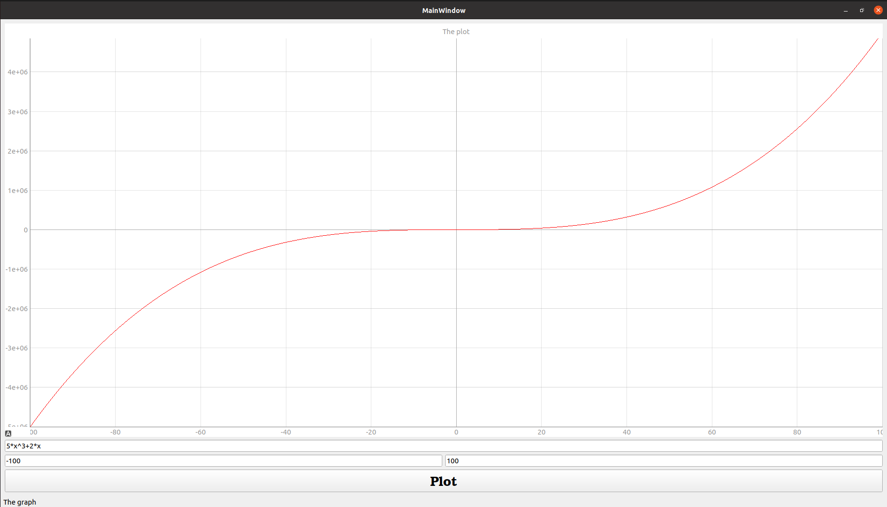
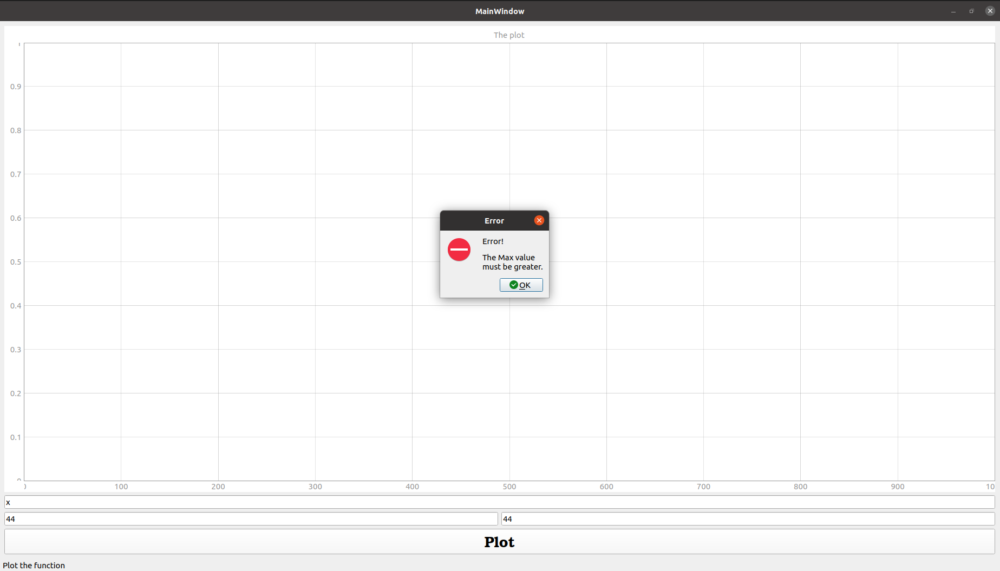

# Function Plotter
### The program plots arbitrary user-entered function of form X.

## results





## Run

1. From the command line create a virtual environment and activate.
```
> python3 -m venv .venv
> source .venv/bin/activate
```

2. Install dependencies.
```
> pip install -r requirements.txt
```

3. Run.
```
> python main.py
```
4. To run tests .
```
> py.test
```
